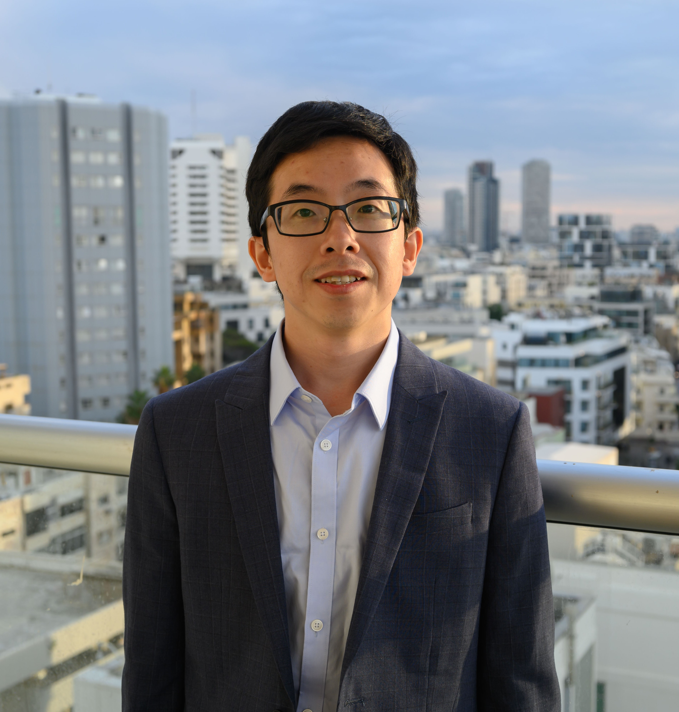

<figure class="left">
  
<!--   <figcaption>. </figcaption> -->
</figure>

# Xiaoxu Chen

Postdoctoral Fellow, McGill University, Canada

Ph.D. (2024) in Civil Engineering, McGill University, Canada

M.S. (2020) in Transportation Engineering, Tongji University, China

B.Eng. (2017) in Traffic Engineering, Harbin Institute of Technology, China

--------------

## Research interests

I am interested in understanding and modeling human behaviors in transportation systems by Bayesian statistics and machine learning methods. Currently, my research centers the following areas:

-------------
## News
- Feb 2025: Our paper "Understanding bus delay patterns under different temporal and weather conditions: A Bayesian Gaussian mixture model" (authors: **Xiaoxu Chen**, Saeid Saidi, Lijun Sun) was accepted by Transportation Research Part C: Emerging Technologies. [[Full-text]](https://www.sciencedirect.com/science/article/pii/S0968090X2500004X)
- Jan 2025: I attended the 104rd Transportation Research Board Annual Meeting (TRB2025) in Washington D.C., USA. My collabrator Zhanhong Cheng and I presented our work in the poster session.
- Oct 2024: I am glad to give a talk on "Bayesian inference of time-varying origin-destination matrices from boarding and alighting counts for transit services" at [MIT Urban Mobility Lab](https://mobility.mit.edu/). [[Slides]](assets/files/MIT_SRB2024.pdf)
- Sep 2024: I began my role as a Postdoctoral Scholar at McGill University, underspervised by Prof. Lijun Sun and Prof. Martin Trépanier.

Found more in [archived news](_posts/2020-11-08-archived-news.md)

-------------
## Selected publications
- **Chen, X.**, Cheng, Z., Jin, J. G., Trépanier, M., & Sun, L. (2023). Probabilistic forecasting of bus travel time with a Bayesian Gaussian mixture model. Transportation Science, 57(6), 1516-1535. [[Full-text]](https://arxiv.org/abs/2206.06915) [[Slides]](assets\files\BayesianGMM_caspt.pdf)
- **Chen, X.**, Cheng, Z., Schmidt, A. M., & Sun, L. (2025). Conditional forecasting of bus travel time and passenger occupancy with Bayesian Markov regime-switching vector autoregression. Transportation Research Part B: Methodological, 192, 103147. [[Full-text]](https://www.sciencedirect.com/science/article/pii/S0191261524002716) [[Slides]](https://xinychen.github.io/slides/LCR24.pdf) **(Best Paper Award from AED60 TRB Statistical and Econometric Methods Committee🏅)**
- **Chen, X.**, Saidi, S., & Sun, L. (2025). Understanding bus delay patterns under different temporal and weather conditions: A Bayesian Gaussian mixture model. Transportation Research Part C: Emerging Technologies, 171, 105000. [[Full-text]](https://www.sciencedirect.com/science/article/pii/S0968090X2500004X)
- **Chen, X.**, Cheng, Z., & Sun, L. (2024). Bayesian inference of time-varying origin-destination matrices from boarding and alighting counts for transit services. (Under review in Transportation Research Part B: Methodological) [[Full-text]](https://arxiv.org/abs/2403.04742)
- **Chen, X.**, Zhang, C., Cheng, Z., Hou, Y., & Sun, L. (2023). A bayesian gaussian mixture model for probabilistic modeling of car-following behaviors. IEEE Transactions on Intelligent Transportation Systems, 25(6), 5880-5891. [[Full-text]](https://ieeexplore.ieee.org/abstract/document/10337758?casa_token=5Xgxq2S6QnwAAAAA:0NUn5lq7-B-XM275000HoFgfnfDKSZ8uMGWEQJ0dSa9vXgh-_WVuJwqjbWfgABggGyvl1AnnTno)
